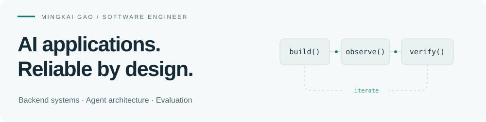

<picture>
  <source media="(max-width: 600px) and (prefers-color-scheme: dark)" srcset="assets/header-mobile-dark.svg">
  <source media="(max-width: 600px) and (prefers-color-scheme: light)" srcset="assets/header-mobile-light.svg">
  <source media="(prefers-color-scheme: dark)" srcset="assets/header-dark.svg">
  <source media="(prefers-color-scheme: light)" srcset="assets/header-light.svg">
  
</picture>

I'm **Mingkai**, an MSCS student at **Northeastern University** and a **Research Assistant / Student Technical Lead at NEURAI Lab**. I build AI applications, their backend infrastructure, and the tools to check whether they work.

**Seeking Summer 2027 software engineering internships.** San Jose, CA · Graduating December 2027

[LinkedIn](https://linkedin.com/in/mingkaigao) · [Email](mailto:mingkaigao420@gmail.com) · [V.O.I.C.E.](https://voice-sim.org)

### Selected work

#### 01 / Agent Reliability Harness
**What happens after the tool call fails?**

A reliability testing framework with adapters for Google ADK, LangGraph, and custom applications. Inject faults, resume interrupted execution, and verify database and file state independently of the agent's answer.

`Fault injection` `Checkpoint recovery` `Idempotency` `OpenTelemetry`

[Code](https://github.com/Mingkai406/agent-reliability-harness) · [42-scenario report](https://github.com/Mingkai406/agent-reliability-harness/blob/main/examples/showcase/report.md) · [Architecture](https://github.com/Mingkai406/agent-reliability-harness/blob/main/docs/architecture.md)

#### 02 / V.O.I.C.E.
**Virtual patients. Real classroom use.**

I lead development of a multi-agent virtual patient platform used in clinical coursework and a 41-student study. My work spans dialogue and multimodal execution, AWS services, persistent sessions, and AI feedback evaluation.

`AWS Lambda` `API Gateway` `DynamoDB` `LLM evaluation`

[Platform](https://voice-sim.org) · [Shared platform repository](https://github.com/nuvoicesim/voice-sim-app)

#### 03 / CreatorPal
**Research recommendations with evidence you can inspect.**

An audience research agent built with Google ADK. Four modular skills connect hybrid retrieval, community rules, and restricted Python analytics to reports with validated citations and analysis artifacts.

`Google ADK` `Agent Skills` `Hybrid retrieval` `Python analytics`

[Code & quickstart](https://github.com/Mingkai406/CreatorPal) · [Example report](https://github.com/Mingkai406/CreatorPal/blob/main/examples/agent/research-report.md) · [Architecture](https://github.com/Mingkai406/CreatorPal#architecture)

<sub>The Harness report uses controlled fault scenarios; the CreatorPal example uses synthetic data and an offline model double.</sub>

### A few questions I keep in the loop

```python
curiosity = (
    "Can the agent show its evidence?",
    "Can the workflow recover without writing twice?",
    "Is the extra orchestration worth its cost?",
)
```

**Previously:** Software Engineer Intern / Team Lead at Evenness — shared backend services, a multi-model Vertex AI gateway for three product teams, and retry-safe billing workflows.

**Recognition:** Northeastern Bridge Builder Award (2026), for technical leadership in developing V.O.I.C.E.

<sub>Working across Python · TypeScript / Node.js · AWS · GCP / Vertex AI · SQL</sub>
